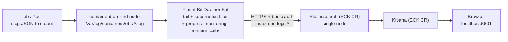

# Logs with EFK (Elasticsearch + Fluent Bit + Kibana)

Metrics tell you *how much* and *how fast*. Logs tell you *what happened*. This guide adds an EFK pipeline alongside the metrics stack: the `obs` app writes structured JSON to stdout, containerd captures it on the node, **Fluent Bit** tails the file, enriches it with Kubernetes metadata, and ships it to **Elasticsearch**, which **Kibana** queries.

Prerequisite: the kind cluster, `monitoring` namespace, and `obs` Deployment from [`METRICS.md`](METRICS.md) must already be running. The Fluent Bit installation here tails the `obs` container's log files specifically.

## End-to-end flow



Same pattern as metrics: an Operator owns the platform (ECK installs CRDs `Elasticsearch`, `Kibana`, ...), declarative CRs describe what you want, and a DaemonSet shipper feeds the backend.

## What is a CRD?

A **CustomResourceDefinition** lets you teach the Kubernetes API a new resource kind. `ServiceMonitor` is not built into Kubernetes — the Prometheus Operator added it. In the same way, the **ECK (Elastic Cloud on Kubernetes)** operator adds `Elasticsearch`, `Kibana`, `Beat`, and `Agent` kinds. You write declarative YAML like `kind: Elasticsearch` and the operator reconciles the underlying StatefulSets, Services, Secrets, and TLS certs.

## App-side: structured JSON logs

[`app/main.go`](app/main.go) uses `log/slog` with a JSON handler so every request emits a structured line on stdout. The `instrument(...)` wrapper logs:

```json
{"time":"...","level":"INFO","msg":"http_request","method":"GET","path":"/work","status":200,"duration_ms":312,"bytes":4096,"remote_addr":"127.0.0.1:54321","user_agent":"curl/8.4.0"}
```

If you came straight from [`METRICS.md`](METRICS.md) and the obs image you built does not yet use slog, rebuild and reload:

```bash
cd app
docker build -t obs:dev .
kind load docker-image obs:dev --name observability
kubectl -n monitoring rollout restart deploy/obs
```

## Install the ECK operator

Two manifests from Elastic — this creates the `elastic-system` namespace, installs the CRDs, and runs the operator pod:

```bash
kubectl create -f https://download.elastic.co/downloads/eck/2.13.0/crds.yaml
kubectl apply -f https://download.elastic.co/downloads/eck/2.13.0/operator.yaml
kubectl -n elastic-system get pods -w   # wait for elastic-operator-0 Ready
```

Verify the new resource kinds are registered:

```bash
kubectl api-resources | grep -iE "elastic|kibana"
```

## Deploy Elasticsearch + Kibana

The manifests live in [`k8s/logging/`](k8s/logging):

| File | What it creates |
| --- | --- |
| [`namespace.yaml`](k8s/logging/namespace.yaml) | `logging` namespace |
| [`elasticsearch.yaml`](k8s/logging/elasticsearch.yaml) | Single-node `Elasticsearch` CR (v8.15), 1Gi JVM heap, 5Gi PVC, `node.store.allow_mmap=false` so Docker Desktop's VM doesn't need a sysctl tweak |
| [`kibana.yaml`](k8s/logging/kibana.yaml) | `Kibana` CR pointing at the ES CR via `elasticsearchRef` (operator wires the URL, CA cert, and credentials) |

```bash
kubectl apply -f k8s/logging/namespace.yaml
kubectl apply -f k8s/logging/elasticsearch.yaml
kubectl apply -f k8s/logging/kibana.yaml

kubectl -n logging get elasticsearch,kibana
kubectl -n logging get pods -w   # wait for green ES + Kibana ready
```

The operator auto-creates these objects you'll consume from Fluent Bit and the browser:

| Object | Name | What it holds |
| --- | --- | --- |
| Service | `elasticsearch-es-http` | HTTPS endpoint on port 9200 |
| Secret | `elasticsearch-es-http-certs-public` | CA cert (`ca.crt`) for verifying ES TLS |
| Secret | `elasticsearch-es-elastic-user` | password for the `elastic` superuser (key `elastic`) |
| Service | `kibana-kb-http` | HTTPS endpoint on port 5601 |

## Install Fluent Bit (scoped to obs only)

[`k8s/logging/fluentbit-values.yaml`](k8s/logging/fluentbit-values.yaml) is a values file for the `fluent/fluent-bit` Helm chart. Five deliberate choices:

- **Tail glob** `/var/log/containers/obs-*_monitoring_obs-*.log` so the DaemonSet only opens the obs app's log files.
- **`kubernetes` filter** parses the pod identity from the filename and calls the kubelet API to attach `kubernetes.namespace_name`, `kubernetes.pod_name`, `kubernetes.container_name`, labels, and annotations. With `Merge_Log On` and `Merge_Log_Key log_processed`, the slog JSON is parsed and placed under a `log_processed.*` sub-object (so each field, e.g. `log_processed.status`, becomes properly typed and filterable in Kibana).
- **Two `grep` filters** re-assert `namespace_name=monitoring` and `container_name=obs` so an accidentally broadened glob still can't leak other pods' logs.
- **TLS verification on**, using the CA mounted from `elasticsearch-es-http-certs-public`. The password is sourced from `elasticsearch-es-elastic-user` via env var.
- **`Logstash_Format On`** writes daily indices `obs-logs-YYYY.MM.DD`.

```bash
helm repo add fluent https://fluent.github.io/helm-charts
helm repo update
helm install fluent-bit fluent/fluent-bit \
  -n logging \
  -f k8s/logging/fluentbit-values.yaml

kubectl -n logging rollout status ds/fluent-bit
kubectl -n logging logs ds/fluent-bit | head -50
```

The chart's default RBAC gives Fluent Bit read access to pods cluster-wide (needed for the `kubernetes` filter's enrichment), and a DaemonSet that volume-mounts `/var/log` from the node.

## Verify the pipeline

Run these in order. Each step has a clear pass/fail signal so you know exactly where the pipeline breaks if it does.

### 1. Cluster and workloads are up

```bash
kubectl get nodes
kubectl -n elastic-system get pods               # expect elastic-operator-0 Running
kubectl -n logging get elasticsearch,kibana      # both should be green/Ready
kubectl -n logging get pods                      # ES, Kibana, fluent-bit DaemonSet pod all Running
kubectl -n monitoring get pods -l app.kubernetes.io/name=obs   # obs Running
```

### 2. Save the elastic user password into a shell variable

Everything below assumes `$ES_PW` is set in your shell.

```bash
ES_PW=$(kubectl -n logging get secret elasticsearch-es-elastic-user \
  -o go-template='{{.data.elastic | base64decode}}')
echo "$ES_PW"
```

### 3. Confirm the obs app is emitting structured JSON

```bash
kubectl -n monitoring logs deploy/obs --tail=3
# Expect lines like:
# {"time":"...","level":"INFO","msg":"http_request","method":"GET","path":"/work","status":200,...}
```

### 4. Drive some traffic so there are logs to ship

In one terminal, keep the port-forward running:

```bash
kubectl -n monitoring port-forward svc/obs 2112:2112
```

In another:

```bash
curl "http://localhost:2112/simulate?rps=20&seconds=120"
```

### 5. Confirm Fluent Bit is reading and shipping

```bash
kubectl -n logging logs ds/fluent-bit | grep -E "inotify_fs_add|output:es" | head -5
# Expect to see watches on /var/log/containers/obs-*.log and ES output workers started.
```

Inspect Fluent Bit's own metrics endpoint:

```bash
kubectl -n logging port-forward ds/fluent-bit 2020:2020 &
sleep 2
curl -s localhost:2020/api/v1/metrics | jq '.output."es.0"'
# Expect non-zero proc_records and zero (or low) retries/errors.
```

### 6. Confirm Elasticsearch received the documents

You can call ES directly from inside the StatefulSet pod (no port-forward needed):

```bash
# Cluster health
kubectl -n logging exec sts/elasticsearch-es-default -- \
  curl -sk -u "elastic:$ES_PW" "https://localhost:9200/_cluster/health" | jq .

# List the obs-logs indices and their sizes
kubectl -n logging exec sts/elasticsearch-es-default -- \
  curl -sk -u "elastic:$ES_PW" "https://localhost:9200/_cat/indices/obs-logs-*?v"

# Total document count
kubectl -n logging exec sts/elasticsearch-es-default -- \
  curl -sk -u "elastic:$ES_PW" "https://localhost:9200/obs-logs-*/_count"
```

### 7. Inspect a sample document

```bash
kubectl -n logging exec sts/elasticsearch-es-default -- \
  curl -sk -u "elastic:$ES_PW" \
  "https://localhost:9200/obs-logs-*/_search?size=1&sort=@timestamp:desc" | jq '.hits.hits[0]._source'
```

You should see something like:

```json
{
  "@timestamp": "2026-05-30T07:46:00.586Z",
  "stream": "stdout",
  "log_processed": {
    "level": "INFO",
    "msg": "http_request",
    "method": "GET",
    "path": "/work",
    "status": 200,
    "duration_ms": 229,
    "bytes": 5144
  },
  "kubernetes": {
    "pod_name": "obs-...",
    "namespace_name": "monitoring",
    "container_name": "obs",
    "host": "observability-control-plane",
    "labels": { "app_kubernetes_io/name": "obs" }
  }
}
```

Note the slog fields are namespaced under `log_processed.*` (because the Fluent Bit config sets `Merge_Log_Key log_processed`). The Kibana KQL queries below use those paths.

### 8. Open Kibana and query

```bash
kubectl -n logging port-forward svc/kibana-kb-http 5601:5601
# Open https://localhost:5601 (accept the self-signed cert warning)
# Username: elastic
# Password: echo "$ES_PW"
```

First time only: **Stack Management → Data Views → Create data view**, name `obs-logs-*`, timestamp field `@timestamp`. Then **Discover** → select the data view → try these KQL queries:

```text
log_processed.status >= 500
log_processed.duration_ms > 200
log_processed.path : "/work" and log_processed.status : 200
log_processed.msg : "http_request"
kubernetes.container_name : "obs"
kubernetes.pod_name : "obs-*"
```

You should see one structured document per HTTP request with the slog fields under `log_processed.*` plus the Kubernetes metadata under `kubernetes.*`.

## Known gotchas on kind + Docker Desktop

- ECK 2.13 supports ES/Kibana up to 8.15. If you bump one, bump the other to match.
- `node.store.allow_mmap: false` is intentional — it sidesteps the `vm.max_map_count=262144` sysctl that Docker Desktop's VM otherwise needs.
- Single-node ES will sit at yellow status on built-in system indices because their default `number_of_replicas` is 1 and we only have one node. Harmless for local.
- Indices grow daily. To reclaim disk: `curl -k -u elastic:$ES_PW -XDELETE https://localhost:9200/obs-logs-*`.
- Kibana uses a self-signed cert. If you want plain HTTP for local convenience, add `spec.http.tls.selfSignedCertificate.disabled: true` to the Kibana CR.
