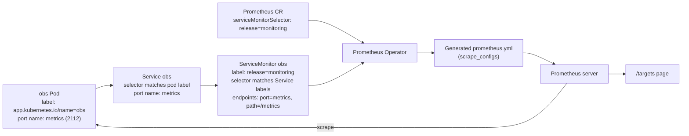

# Metrics with kube-prometheus-stack

This guide walks through standing up the metrics half of the observability stack: a kind cluster, the [kube-prometheus-stack](https://github.com/prometheus-community/helm-charts/tree/main/charts/kube-prometheus-stack) Helm chart (which bundles Prometheus Operator + Prometheus + Alertmanager + Grafana + node-exporter + kube-state-metrics), and a custom Go HTTP server in [`app/`](app) that exposes its own application metrics. Prometheus discovers the app automatically via a `ServiceMonitor`.

The companion logs guide is in [`LOGS.md`](LOGS.md) and assumes the cluster and obs app from this guide are already running.

## Create the cluster

```bash
kind create cluster --name observability
kubectl cluster-info
kubectl get nodes
```

## Install helm

For Mac:

```bash
brew install helm
helm version
```

Add the Prometheus community repository:

```bash
helm repo add prometheus-community https://prometheus-community.github.io/helm-charts
helm repo update
```

## Install kube-prometheus-stack

Create a new namespace:

```bash
kubectl create namespace monitoring
```

Install the chart (optionally with a local overrides file):

```bash
helm install monitoring prometheus-community/kube-prometheus-stack \
  -n monitoring \
  -f custom_kube_prometheus_stack.yml
```

Check the pods and services:

```bash
kubectl get pods -n monitoring
kubectl get svc -n monitoring
```

Port-forward the components you want in your browser:

```bash
kubectl port-forward -n monitoring svc/prometheus-operated 9090:9090
kubectl port-forward -n monitoring svc/monitoring-grafana 8080:80
kubectl port-forward -n monitoring svc/alertmanager-operated 9093:9093
kubectl port-forward -n monitoring svc/monitoring-prometheus-node-exporter 9100
```

Then open:

- <http://localhost:8080/metrics> — port-forwarded kube-state-metrics (Kubernetes object state)
- <http://localhost:9100/metrics> — port-forwarded node-exporter (machine/node metrics)
- <http://localhost:9090/targets> — Prometheus Targets

Every exporter exposes metrics in the same line-oriented text format:

```text
metric_name{label="value"} number
```

Example:

```text
kube_pod_status_phase{pod="nginx",phase="Running"} 1
```

## About metrics

### kube-state-metrics

`kube-state-metrics` is an open-source add-on that listens to the Kubernetes API server and generates metrics about the state of cluster objects.

`kube-state-metrics` does NOT measure CPU usage, memory usage, or network traffic. It only exposes Kubernetes object state.

```text
Deployment scaled to 5 replicas
        ↓
API server stores desired state
        ↓
kube-state-metrics watches change
        ↓
generates metric:

kube_deployment_status_replicas 5
```

### node-exporter

`node-exporter` reads Linux kernel/system files under `/proc` and `/sys`.

Examples:

```bash
cat /proc/meminfo
cat /proc/stat
```

It converts those OS stats into Prometheus metrics:

```text
CPU ticks
    ↓
node-exporter
    ↓
node_cpu_seconds_total
```

### Prometheus /targets page

A target is something Prometheus scrapes. Each target shows:

- endpoint
- job name
- scrape URL
- scrape interval
- last scrape time
- scrape duration
- UP / DOWN state

## Pull model

The Prometheus ecosystem is primarily:

```text
PULL MODEL
Prometheus ---> exporter
```

Flow:

```text
Every 15s (example)
Prometheus:
  GET http://node-exporter:9100/metrics
Exporter:
  returns metrics text
Prometheus parses and stores it
```

Pros of pull:

- Prometheus controls scrape intervals
- easier service discovery
- exporters stay simple
- Prometheus can detect dead targets
- scalable in Kubernetes

Exceptions (push) exist:

- Pushgateway
- short-lived batch jobs
- `remote_write` systems

## Service discovery

In the pull model, Prometheus needs to *find* the things it should scrape. With kube-prometheus-stack, that "finding" is done by the **Prometheus Operator** using Kubernetes-native objects instead of a hand-edited `prometheus.yml`.

### The key objects

- **Service** — the Kubernetes object that gives a stable virtual IP and DNS name for a set of pods. Its `selector` matches pod labels, so the Service knows which pods (and which port on those pods) carry metrics.
- **ServiceMonitor** (CRD installed by kube-prometheus-stack) — a *declarative scrape config*. It does not scrape anything itself; it tells the Operator: "find Services with these labels in these namespaces, and scrape their named port at this path and interval."
- **Prometheus** (CRD) — the Operator-managed Prometheus instance. It has a `serviceMonitorSelector` and `serviceMonitorNamespaceSelector` that decide *which* ServiceMonitors it will pick up.

### The `release` label

When you ran `helm install monitoring prometheus-community/kube-prometheus-stack ...`, the chart created a Prometheus CR whose default selector is:

```yaml
serviceMonitorSelector:
  matchLabels:
    release: monitoring
serviceMonitorNamespaceSelector: {}   # all namespaces
```

The value `monitoring` here is your Helm release name. So any ServiceMonitor in the cluster that carries the label `release: monitoring` is eligible to be picked up; anything without that label is ignored. This is exactly why [`k8s/servicemonitor.yaml`](k8s/servicemonitor.yaml) has:

```yaml
metadata:
  labels:
    release: monitoring
```

Forget that one label and your target silently never shows up in `/targets`.

### End-to-end discovery flow



Step by step:

1. The **Pod** exposes `/metrics` on container port `2112` (named `metrics`).
2. The **Service** (`obs` in namespace `monitoring`) selects that pod and exposes a service port also named `metrics`.
3. The **ServiceMonitor** (`obs` in namespace `monitoring`) carries `release: monitoring` and its `spec.selector.matchLabels` points at the Service's labels. Its `endpoints[].port: metrics` refers to the *Service port name*, not a numeric port — this is why we name the port consistently across Deployment and Service.
4. The **Prometheus Operator** watches all ServiceMonitors. Because the Prometheus CR's selector is `release: monitoring`, the Operator includes our ServiceMonitor in the generated scrape config and reloads Prometheus.
5. Prometheus uses the Kubernetes API for **endpoint discovery**: it lists the Endpoints behind the Service and scrapes each pod IP at `:2112/metrics` on the configured interval.
6. The target appears in Prometheus' `/targets` page as `serviceMonitor/monitoring/obs/0` with state `UP`, and its samples become queryable.

```text
┌─────────────────────────────────────────────────────────────────┐
│ Prometheus CR                                                   │
│   serviceMonitorSelector: { release: monitoring }               │
└────────────────────────┬────────────────────────────────────────┘
                         │ matches label on
                         ▼
┌─────────────────────────────────────────────────────────────────┐
│ ServiceMonitor "obs"                                            │
│   labels: { release: monitoring }      ← selected by Prometheus │
│   spec.selector: { app.kubernetes.io/name: obs }                │
│   spec.namespaceSelector: [monitoring]                          │
│   spec.endpoints[0].port: metrics                               │
└────────────────────────┬────────────────────────────────────────┘
                         │ matches labels on
                         ▼
┌─────────────────────────────────────────────────────────────────┐
│ Service "obs" (namespace: monitoring)                           │
│   labels: { app.kubernetes.io/name: obs }   ← selected by SM    │
│   spec.ports[0].name: metrics               ← named port match  │
│   spec.selector: { app.kubernetes.io/name: obs }                │
└────────────────────────┬────────────────────────────────────────┘
                         │ matches labels on
                         ▼
┌─────────────────────────────────────────────────────────────────┐
│ Pod (from Deployment "obs")                                     │
│   labels: { app.kubernetes.io/name: obs }   ← selected by Svc   │
│   containers[0].ports[0].name: metrics, containerPort: 2112     │
└─────────────────────────────────────────────────────────────────┘
                         │
                         ▼
              EndpointSlice "obs-xxxx"
              (auto-created by Kubernetes; lists pod IPs)
                         │
                         ▼
       Prometheus Operator translates ServiceMonitor → scrape_config
       Prometheus scrapes each pod IP at :2112/metrics every 15s
```

# Custom metrics

Instrumentation of metrics.

Metric types:

- **Counter** (monotonically increasing, `.inc()`)
- **Gauge** (up and down, `.inc()` / `.dec()`)
- **Histogram** (buckets of observations)
- **Summary** (streaming quantiles)

## Custom metrics Go app

A Go HTTP server in [`app/`](app) registers all four metric types using `github.com/prometheus/client_golang` and exposes them on `/metrics` (port `2112`). The Kubernetes manifests in [`k8s/`](k8s) deploy it into the existing `monitoring` namespace with a `ServiceMonitor` carrying the `release: monitoring` label so the existing kube-prometheus-stack auto-scrapes it.

### Metrics exposed

| Type | Name | Labels | Description |
| --- | --- | --- | --- |
| Counter | `http_requests_total` | `method,path,status` | Total HTTP requests processed |
| Gauge | `http_in_flight_requests` | — | Current in-flight requests (inc on enter, dec on exit) |
| Histogram | `http_request_duration_seconds` | `method,path` | Request latency, default buckets |
| Summary | `http_response_size_bytes` | `method,path` | Response body size, quantiles 0.5 / 0.9 / 0.99 |

### Endpoints

- `GET /` — instant "ok".
- `GET /work` — random sleep 0–500 ms and random 256 B–8 KB payload (spreads histogram + summary).
- `GET /fail` — returns 500 ~30% of the time (exercises the `status` label).
- `GET /simulate?rps=20&seconds=60` — kicks off a background goroutine that hits `/work` and `/fail` at the requested rate for the requested duration. Returns immediately with a JSON acknowledgement.
- `GET /healthz` — liveness/readiness probe (not instrumented).
- `GET /metrics` — Prometheus exposition (not instrumented).

### Run locally

```bash
cd app
go run .
```

In another shell:

```bash
curl http://localhost:2112/
curl "http://localhost:2112/simulate?rps=20&seconds=60"
curl http://localhost:2112/metrics | head -n 40
```

### Build the image and load it into kind

```bash
cd app
docker build -t obs:dev .
kind load docker-image obs:dev --name observability
```

### Deploy to the cluster

The `monitoring` namespace was already created earlier (`kubectl create namespace monitoring`), so we just apply the workload manifests:

```bash
kubectl apply -f k8s/deployment.yaml
kubectl apply -f k8s/service.yaml
kubectl apply -f k8s/servicemonitor.yaml

kubectl -n monitoring rollout status deploy/obs
kubectl -n monitoring get pods,svc,servicemonitor -l app.kubernetes.io/name=obs
```

### Generate load and view metrics

```bash
kubectl -n monitoring port-forward svc/obs 2112:2112
curl "http://localhost:2112/simulate?rps=20&seconds=120"
```

Then open Prometheus at <http://localhost:9090/targets> and confirm the `monitoring/obs` target is `UP`. Try these PromQL queries in the Prometheus or Grafana explore view:

```promql
rate(http_requests_total[1m])
sum by (status) (rate(http_requests_total[1m]))
http_in_flight_requests
histogram_quantile(0.95, sum by (le) (rate(http_request_duration_seconds_bucket[1m])))
http_response_size_bytes{quantile="0.9"}
```

Once the obs app is running and being scraped, continue to [`LOGS.md`](LOGS.md) to add the EFK logging pipeline alongside the metrics stack.
