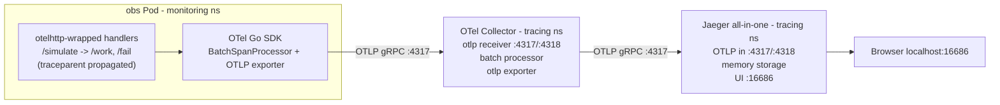

# Traces with OpenTelemetry + Jaeger

Metrics tell you *how much* and *how fast*. Logs tell you *what happened*. Traces tell you *where the time went* as a single request fans out across hops. This guide adds the third observability pillar: the `obs` app is instrumented with the **OpenTelemetry Go SDK**, exports spans over **OTLP** to an **OpenTelemetry Collector**, which forwards them to **Jaeger**, where you explore the request waterfall in the Jaeger UI.

Prerequisite: the kind cluster, `monitoring` namespace, and `obs` Deployment from [`METRICS.md`](METRICS.md) must already be running. This guide does not depend on the EFK logging stack, but the slog lines now carry `trace_id`/`span_id` so traces and logs cross-link if you ran [`LOGS.md`](LOGS.md) too.

## End-to-end flow



Same pattern as logs: the app produces telemetry, a shipper layer (here the OpenTelemetry Collector, analogous to Fluent Bit) buffers and forwards it, and a backend (Jaeger, analogous to Elasticsearch + Kibana) stores and visualizes it.

## What is a span, a trace, and propagation?

- A **span** is one timed operation (an HTTP server handler, an outbound HTTP call, a DB query) with a name, start/end time, attributes, and a status.
- A **trace** is a tree of spans sharing one `trace_id`. Each span has its own `span_id` and points at its `parent_span_id`.
- **Context propagation** is how the trace crosses a process/network boundary: the client injects a `traceparent` HTTP header (W3C Trace Context), and the server extracts it so its span joins the same trace instead of starting a new one.

The `obs` app's `/simulate` endpoint is a built-in demo of this: it fires background HTTP requests at its own `/work` and `/fail` endpoints, so you get a real parent/child span tree within the trace.

## App-side: OpenTelemetry instrumentation

[`app/main.go`](app/main.go) was instrumented with four small additions:

1. **Tracer init** (`initTracer`): builds a `TracerProvider` with an OTLP/gRPC exporter and a `service.name=obs` resource, registers it globally, and sets the W3C `TraceContext` propagator. The exporter endpoint comes from the standard `OTEL_EXPORTER_OTLP_ENDPOINT` env var (the `http://` scheme selects an insecure connection).

```go
exporter, err := otlptracegrpc.New(ctx)
tp := sdktrace.NewTracerProvider(
    sdktrace.WithBatcher(exporter),
    sdktrace.WithResource(res), // service.name=obs
)
otel.SetTracerProvider(tp)
otel.SetTextMapPropagator(propagation.TraceContext{})
```

2. **Server spans**: each route is wrapped with `otelhttp.NewHandler(instrument(path, h), path)` via the `traced(...)` helper, so every request gets a server span named after its route and the inner logger sees the active span.

3. **Client propagation**: the `/simulate` load generator uses an `http.Client` whose transport is `otelhttp.NewTransport(http.DefaultTransport)`, and issues requests with `http.NewRequestWithContext(runCtx, ...)`. A parent span `simulate_load` wraps the run, each outbound call becomes a child client span, and the `traceparent` header propagates so the receiving `/work` / `/fail` server spans continue the same trace.

4. **Log/trace correlation**: the `instrument(...)` logger attaches `trace_id` and `span_id` to every `http_request` slog line, so a log in Kibana points back to its trace in Jaeger.

The OTLP endpoint is injected in [`k8s/deployment.yaml`](k8s/deployment.yaml):

```yaml
env:
  - name: OTEL_EXPORTER_OTLP_ENDPOINT
    value: http://otel-collector.tracing.svc.cluster.local:4317
```

## Deploy Jaeger + the OpenTelemetry Collector

The manifests live in [`k8s/tracing/`](k8s/tracing):

| File | What it creates |
| --- | --- |
| [`namespace.yaml`](k8s/tracing/namespace.yaml) | `tracing` namespace |
| [`jaeger.yaml`](k8s/tracing/jaeger.yaml) | Jaeger all-in-one `Deployment` + `Service` (`COLLECTOR_OTLP_ENABLED=true`, in-memory storage). Exposes UI `16686` and OTLP `4317`/`4318`. |
| [`otel-collector.yaml`](k8s/tracing/otel-collector.yaml) | Collector `ConfigMap` + `Deployment` + `Service`. OTLP receiver on `4317`/`4318`, `batch` processor, OTLP exporter to `jaeger:4317`. |

```bash
kubectl apply -f k8s/tracing/namespace.yaml
kubectl apply -f k8s/tracing/jaeger.yaml
kubectl apply -f k8s/tracing/otel-collector.yaml

kubectl -n tracing rollout status deploy/jaeger
kubectl -n tracing rollout status deploy/otel-collector
kubectl -n tracing get pods,svc
```

## Rebuild and reload the obs image

The instrumentation lives in the app, so rebuild the image and restart the Deployment (which now carries the OTLP endpoint env):

```bash
cd app
docker build -t obs:dev .
kind load docker-image obs:dev --name observability
cd ..

kubectl apply -f k8s/deployment.yaml
kubectl -n monitoring rollout restart deploy/obs
kubectl -n monitoring rollout status deploy/obs
```

## Verify the pipeline

Run these in order. Each step has a clear pass/fail signal so you know exactly where the pipeline breaks if it does.

### 1. Components are up

```bash
kubectl -n tracing get pods         # jaeger + otel-collector both Running
kubectl -n monitoring get pods -l app.kubernetes.io/name=obs   # obs Running
```

### 2. Drive some traffic so there are traces to ship

```bash
kubectl -n monitoring port-forward svc/obs 2112:2112
```

In another shell:

```bash
curl "http://localhost:2112/simulate?rps=20&seconds=120"
```

### 3. Confirm the obs app is exporting spans

```bash
kubectl -n monitoring logs deploy/obs --tail=5
# slog lines now include trace_id / span_id, e.g.:
# {"level":"INFO","msg":"http_request","path":"/work","status":200,"trace_id":"...","span_id":"..."}
```

### 4. Confirm the Collector is receiving and forwarding

```bash
kubectl -n tracing logs deploy/otel-collector --tail=20
# Expect startup lines for the otlp receiver and otlp exporter, no export errors.
```

### 5. Open Jaeger and explore

```bash
kubectl -n tracing port-forward svc/jaeger 16686:16686
# Open http://localhost:16686
```

In the Jaeger UI:

1. **Service** dropdown -> select `obs` (appears once the app has sent spans).
2. Click **Find Traces**.
3. Open a trace started by `/simulate`. You should see the `simulate_load` parent span with child client spans for each outbound call, and the corresponding `/work` / `/fail` server spans continuing the same trace.
4. Open a `/work` trace and read the span duration; that latency is the same random 0-500 ms sleep your `http_request_duration_seconds` histogram measures in Prometheus.

## Cross-pillar correlation

Because each `http_request` log line carries `trace_id`:

- Copy a `trace_id` from a Kibana log (KQL: `log_processed.trace_id : "<id>"`) and paste it into Jaeger's **Search by Trace ID** to jump from "what happened" to "where the time went".
- Conversely, from a slow span in Jaeger, grab its `trace_id` and filter logs in Kibana for the full request story.

## Known gotchas on kind + Docker Desktop

- Jaeger uses **in-memory storage** here, so all traces are lost when the `jaeger` pod restarts. Fine for local; switch `SPAN_STORAGE_TYPE` to `badger` (with a PVC) for persistence.
- If `obs` logs show OTLP export errors, the most common cause is the endpoint scheme: it must be `http://...:4317` (insecure). An `https://` or bare `host:port` value makes the gRPC exporter attempt TLS and fail against the plaintext collector.
- No spans for `obs` in the Service dropdown usually means no traffic yet (hit `/simulate`) or the image wasn't reloaded after instrumenting (`kind load` + `rollout restart`).
- The OTel Collector's `batch` processor buffers spans, so expect a few seconds of delay before traces appear in Jaeger.
