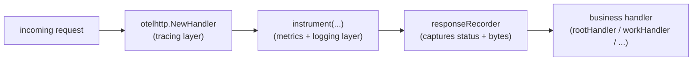

# obs — the workload app

A single Go HTTP server that acts as the observable workload for this stack. It is deliberately instrumented for all three pillars at once:

- **Metrics** — Prometheus client (`/metrics`).
- **Logs** — structured JSON via `log/slog` to stdout.
- **Traces** — OpenTelemetry spans exported over OTLP.

This document focuses on **how the HTTP handlers are wrapped together**, why the layering is in that order, and what each wrapper does to a request.

## Endpoints

| Route | Handler | Wrapped? | Purpose |
| --- | --- | --- | --- |
| `/` | `rootHandler` | yes | instant `ok` |
| `/work` | `workHandler` | yes | random 0-500 ms sleep + random 256 B-8 KB body |
| `/fail` | `failHandler` | yes | returns 500 ~30% of the time |
| `/simulate` | `simulateHandler` | yes | fires background load at `/work` and `/fail` |
| `/healthz` | `healthzHandler` | no | liveness/readiness probe |
| `/metrics` | `promhttp.Handler()` | no | Prometheus exposition |

## The wrapping chain (inbound requests)

The four application routes are registered in `main()` through a single helper, `traced(...)`:

```287:290:app/main.go
	mux.Handle("/", traced("/", rootHandler))
	mux.Handle("/work", traced("/work", workHandler))
	mux.Handle("/fail", traced("/fail", failHandler))
	mux.Handle("/simulate", traced("/simulate", simulateHandler))
```

`traced(...)` composes two layers around the business handler:

```130:135:app/main.go
// traced wraps an instrumented handler with an OpenTelemetry server span named
// after the route, so each request produces a span whose context (trace id) is
// available to the inner instrument() logger.
func traced(path string, h http.HandlerFunc) http.Handler {
	return otelhttp.NewHandler(instrument(path, h), path)
}
```

So every wrapped route is really three nested layers. From outermost to innermost:



### Layer 1 (outermost) — `otelhttp.NewHandler` — tracing

What it does to each request:
1. **Extracts** any inbound W3C `traceparent` header using the global propagator (set in `initTracer`), so this request can continue an existing trace.
2. **Starts a server span** named after the route (the `path` argument) and stores it in `req.Context()`.
3. Records standard HTTP span attributes (method, status, etc.) and ends the span when the handler returns.
4. Delegates to the inner handler.

Why it is outermost: the span must exist **before** the logging layer runs, so the logger can read `trace_id`/`span_id` from the context; and putting it on the outside means the span measures the entire handler, including the metrics/logging work.

### Layer 2 (middle) — `instrument(...)` — metrics + logging

```86:128:app/main.go
func instrument(path string, h http.HandlerFunc) http.HandlerFunc {
	return func(w http.ResponseWriter, req *http.Request) {
		start := time.Now()

		// Track in-flight requests
		httpInFlightRequests.Inc()
		defer httpInFlightRequests.Dec()

		rec := &responseRecorder{ResponseWriter: w}
		h(rec, req)

		status := strconv.Itoa(rec.status)
		duration := time.Since(start)
		httpRequestsTotal.WithLabelValues(req.Method, path, status).Inc()
		httpRequestDurationSeconds.WithLabelValues(req.Method, path).Observe(duration.Seconds())
		httpResponseSizeBytes.WithLabelValues(req.Method, path).Observe(float64(rec.bytesWritten))
		...
```

Step by step, this closure:
1. Records a start time.
2. Increments the `http_in_flight_requests` gauge and `defer`s the decrement (so it always drops, even on panic/early return).
3. Wraps the `http.ResponseWriter` in a `responseRecorder` (layer 3) so it can later read the status code and byte count.
4. Calls the inner business handler.
5. After the handler returns, updates three metrics: the `http_requests_total` counter, the `http_request_duration_seconds` histogram, and the `http_response_size_bytes` summary — all labeled by `path` (and method/status where applicable).
6. Picks a log level from the status code (>=500 error, >=400 warn, else info).
7. Builds a structured `http_request` slog line and, crucially, pulls `trace_id`/`span_id` out of `req.Context()` (populated by layer 1) so logs and traces cross-link:

```118:126:app/main.go
		// Correlate logs with traces: attach the active trace/span ids so the
		// same identifiers are searchable in Kibana and clickable in Jaeger.
		if sc := trace.SpanContextFromContext(req.Context()); sc.HasTraceID() {
			attrs = append(attrs,
				slog.String("trace_id", sc.TraceID().String()),
				slog.String("span_id", sc.SpanID().String()),
			)
		}
		slog.LogAttrs(req.Context(), level, "http_request", attrs...)
```

### Layer 3 (innermost helper) — `responseRecorder`

```65:84:app/main.go
type responseRecorder struct {
	http.ResponseWriter
	status       int
	bytesWritten int64
}
```

A thin `http.ResponseWriter` wrapper that remembers the status code (via `WriteHeader`) and accumulates the number of bytes written (via `Write`). Without it, the handler would write straight to the socket and the metrics/logging layer would have no way to know the response status or size. It must be in place *before* the business handler runs, which is why `instrument` creates it and passes it down.

### The business handler

`rootHandler`, `workHandler`, `failHandler`, `simulateHandler` — plain `http.HandlerFunc`s with no observability code in them. They stay focused on behavior; all the cross-cutting concerns live in the wrappers.

## Why these two are NOT wrapped

```291:292:app/main.go
	mux.HandleFunc("/healthz", healthzHandler)
	mux.Handle("/metrics", promhttp.Handler())
```

- **`/healthz`** is hit frequently by the kubelet's liveness/readiness probes. Wrapping it would flood the metrics with probe traffic and create a span on every probe — noise that hides real request signal.
- **`/metrics`** is the Prometheus scrape endpoint. Instrumenting the endpoint that *reports* metrics would have Prometheus's own scrapes inflate the counters it scrapes. It is served directly by `promhttp.Handler()`.

## The outbound side (`/simulate`)

Tracing is not only about incoming requests. `simulateHandler` generates load by calling `/work` and `/fail` over HTTP, and it propagates trace context outward so those calls join the same trace:

```187:194:app/main.go
		runCtx, runSpan := otel.Tracer("obs").Start(context.Background(), "simulate_load")
		defer runSpan.End()
		ticker := time.NewTicker(time.Second / time.Duration(rps))
		defer ticker.Stop()
		client := &http.Client{
			Timeout:   5 * time.Second,
			Transport: otelhttp.NewTransport(http.DefaultTransport),
		}
```

- A parent span `simulate_load` wraps the whole run.
- The client's transport is wrapped with `otelhttp.NewTransport`, which starts a **client span** per request and injects the W3C `traceparent` header.
- Because the targets (`/work`, `/fail`) are served by the otelhttp-wrapped handlers above, they **extract** that header and become child server spans — producing the full `simulate_load -> client GET -> server /work` tree visible in Jaeger.

## Request lifecycle summary

For a wrapped route, a single request flows:

```text
otelhttp: extract traceparent, start server span, put it in ctx
  instrument: start timer, inc in-flight gauge, install responseRecorder
    business handler: do work, write response (recorder captures status+bytes)
  instrument: record counter/histogram/summary, emit slog line with trace_id
otelhttp: set span attributes, end span
```

This is the classic middleware/decorator pattern: each layer adds one cross-cutting concern, the order is chosen so each layer can see what it needs from the layer outside it, and the business handlers stay clean.
